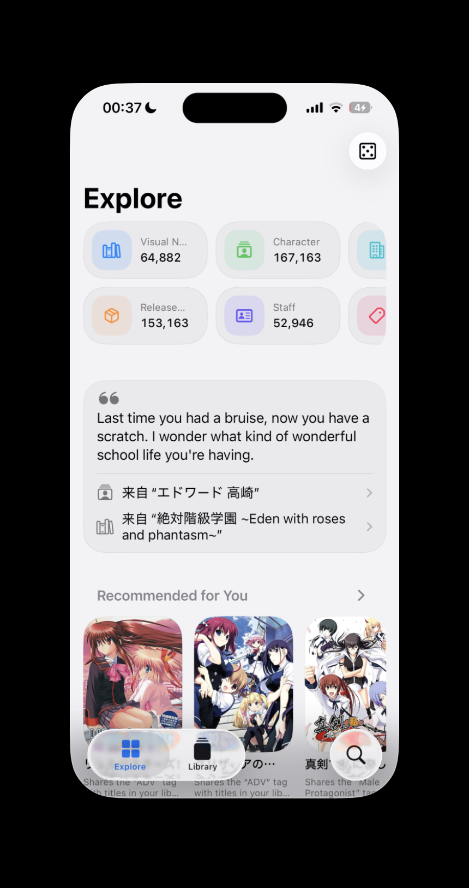
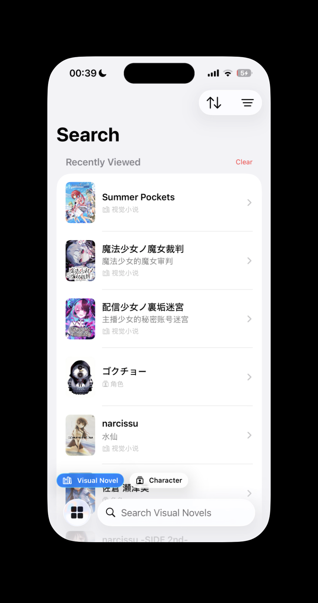
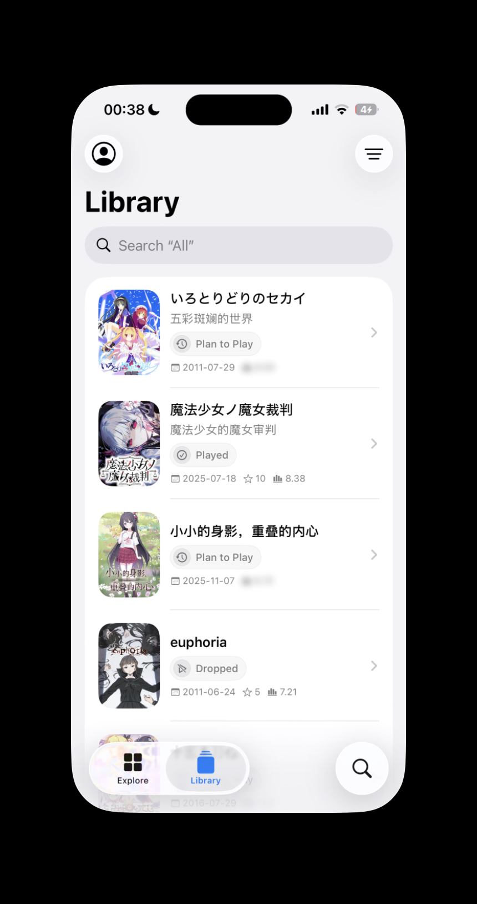
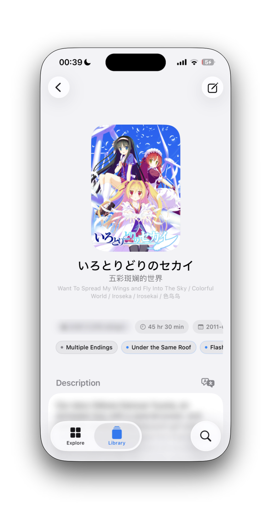
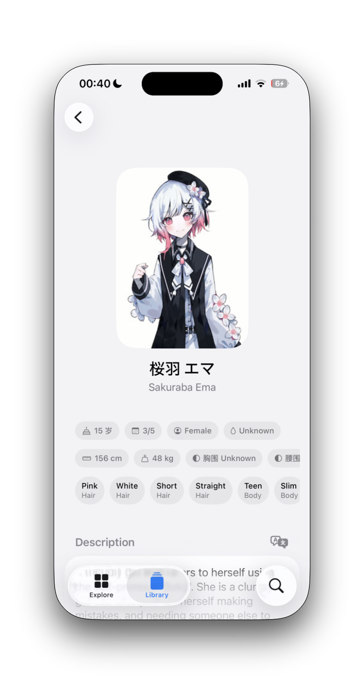
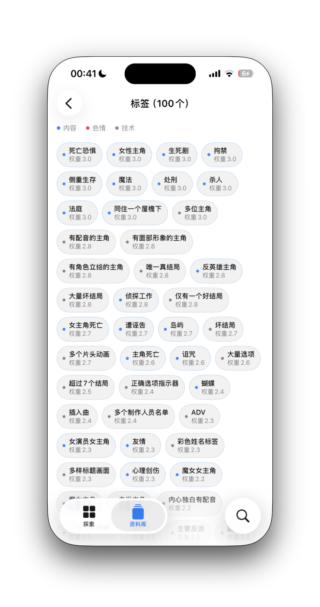
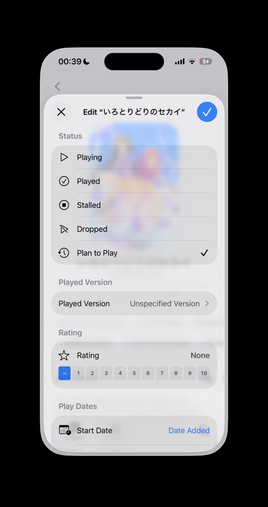
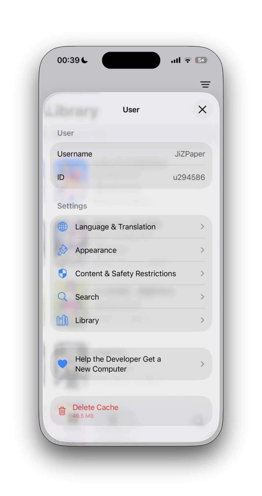

  <a href="./README.md">English</a> ·
  <a href="./README.zh-Hans.md">简体中文</a> ·
  <a href="./README.zh-Hant.md">繁體中文</a> ·
  <strong>日本語</strong> ·
  <a href="./README.ko.md">한국어</a>

  

<h1 align="center">PaperVN</h1>

  <strong>物語と出会い、細部まで知り、VNDBライブラリをいつでも最新に。</strong>

  ビジュアルノベルとの出会いからプレイ記録までを支える、iPhone・iPad向けのネイティブVNDBクライアントです。

  iPhone・iPad · iOS / iPadOS 26以降 · SwiftUI · 5言語対応

  
  
  

探索 · 検索 · ライブラリ

## 作品の魅力を、細部まで

概要から、あらすじ、タグ、スクリーンショット、リリース、制作会社、スタッフ、関連作品、外部リンクといった重要な情報へ自然にたどれます。キャラクターページでは、特徴、声優、登場作品を一か所で確認できます。

  
  

ビジュアルノベル詳細 · キャラクター詳細

## 自分に合った方法で探す

ビジュアルノベルやキャラクターを検索し、言語、プラットフォーム、作品の長さ、評価、開発状況を組み合わせて絞り込めます。気の向くままに作品を探したいときは、タグ、特徴、リリース、スタッフ、制作会社などからたどることもできます。

  

タグ・カテゴリから探す

## ライブラリをいつでも最新に

VNDBアカウントを連携すれば、ライブラリを整理し、プレイ状況、プレイしたバージョン、評価、開始日・終了日を更新できます。言語、外観、検索、コンテンツと安全性に関する設定にもすぐアクセスできます。

  
  

ライブラリ項目を編集 · PaperVNを自分好みに

## 主な機能

- VNDBライブラリをもとに端末上で算出する、パーソナライズされた作品提案。
- 表示・除外と「いずれか」「すべて」の一致条件を組み合わせられる高度な検索フィルター。
- 性的・暴力的な画像の表示制御に加え、ネタバレ、評価、あらすじを必要に応じてぼかせるコンテンツ設定。
- 簡体字中国語、繁体字中国語、英語、日本語、韓国語のインターフェイス。タイトル言語の設定と端末上でのあらすじ翻訳にも対応。
- スクリーンショットのプレビュー、拡大、共有、写真への保存。

## 動作環境

- iOS 26.0以降またはiPadOS 26.0以降
- インターネット接続

## VNDBアカウントを連携

閲覧、作品の探索、公開データの検索はサインインなしで利用できます。ライブラリの読み取りと編集には、ご自身のVNDB Tokenが必要です。

1. VNDBの[My Profile → Applications](https://vndb.org/u/tokens)ページを開きます。
2. `listread`と`listwrite`の権限を付与したTokenを作成します。
3. PaperVNの「ユーザー」画面にTokenを貼り付けます。

PaperVNはTokenをiOS Keychainに保存します。Tokenは決して共有しないでください。漏えいした場合は、VNDBですぐに無効化し、新しいTokenを作成してください。

## 使用技術

- Swift、SwiftUI、Combine、Swift Concurrency
- URLSession、Codable、[VNDB Kana API](https://api.vndb.org/kana)
- Keychain、Translation、StoreKit 2、Photos、SafariServices
- Swift Testing、XCTest
- サードパーティ製のSwift Packageへの依存なし

## データソースと免責事項

PaperVNは[VNDB Kana API](https://api.vndb.org/kana)を通じて、ビジュアルノベルのメタデータと画像を取得します。これらのデータには[VNDB Data License](https://vndb.org/d17)およびAPI利用規約が適用されます。

PaperVNは非公式の第三者プロジェクトです。[VNDB](https://vndb.org/)との提携関係はなく、VNDBによる承認・推奨を受けたものではありません。
